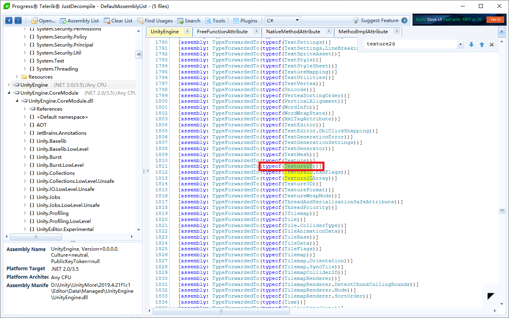

# 关于Unity中使用Texture2D与其疑似造成内存泄漏的探索

## 1 对测试用工程进行调试

通过代码调试，排除了协程、迭代器、字典作为可能造成内存泄漏的原因。

**排除协程** 去除协程前后，调试结果没有区别

**排除迭代器和字典** 我自己写了个简单的链表结构，使用fori而不使用foreach作为循环手段，不会触发字典（dictionary）的resize方法，理论上不会出现因字典造成的可能的内存泄露。但是经过测试发现，使用字典与迭代器与不使用字典与迭代器得到的结果是相近的。

然后通过查看方法的调用顺序，（我认为）以上两点是C#脚本中唯二可能造成内存溢出的地方，但经过测试均被排除。所以我认为问题可能不在我们写的C#脚本当中。


## 2 空项目中测试C#脚本

**创建指定材质并查看内存变化**

```c#
 Texture2D tex = new Texture2D(16, 16, TextureFormat.DXT5, false);
 //以下代码来自UnityAPI
 //https://docs.unity3d.com/cn/2019.4/ScriptReference/Texture2D.LoadRawTextureData.html
 byte[] pvrtcBytes = new byte[]
 {
     0x30, 0x32, 0x32, 0x32, 0xe7, 0x30, 0xaa, 0x7f, 0x32, 0x32, 0x32, 0x32, 0xf9, 0x40, 0xbc, 0x7f,
     0x03, 0x03, 0x03, 0x03, 0xf6, 0x30, 0x02, 0x05, 0x03, 0x03, 0x03, 0x03, 0xf4, 0x30, 0x03, 0x06,
     0x32, 0x32, 0x32, 0x32, 0xf7, 0x40, 0xaa, 0x7f, 0x32, 0xf2, 0x02, 0xa8, 0xe7, 0x30, 0xff, 0xff,
     0x03, 0x03, 0x03, 0xff, 0xe6, 0x40, 0x00, 0x0f, 0x00, 0xff, 0x00, 0xaa, 0xe9, 0x40, 0x9f, 0xff,
     0x5b, 0x03, 0x03, 0x03, 0xca, 0x6a, 0x0f, 0x30, 0x03, 0x03, 0x03, 0xff, 0xca, 0x68, 0x0f, 0x30,
     0xaa, 0x94, 0x90, 0x40, 0xba, 0x5b, 0xaf, 0x68, 0x40, 0x00, 0x00, 0xff, 0xca, 0x58, 0x0f, 0x20,
     0x00, 0x00, 0x00, 0xff, 0xe6, 0x40, 0x01, 0x2c, 0x00, 0xff, 0x00, 0xaa, 0xdb, 0x41, 0xff, 0xff,
     0x00, 0x00, 0x00, 0xff, 0xe8, 0x40, 0x01, 0x1c, 0x00, 0xff, 0x00, 0xaa, 0xbb, 0x40, 0xff, 0xff,
     0x30, 0x32, 0x32, 0x32, 0xe7, 0x30, 0xaa, 0x7f, 0x32, 0x32, 0x32, 0x32, 0xf9, 0x40, 0xbc, 0x7f,
     0x03, 0x03, 0x03, 0x03, 0xf6, 0x30, 0x02, 0x05, 0x03, 0x03, 0x03, 0x03, 0xf4, 0x30, 0x03, 0x06,
     0x32, 0x32, 0x32, 0x32, 0xf7, 0x40, 0xaa, 0x7f, 0x32, 0xf2, 0x02, 0xa8, 0xe7, 0x30, 0xff, 0xff,
     0x03, 0x03, 0x03, 0xff, 0xe6, 0x40, 0x00, 0x0f, 0x00, 0xff, 0x00, 0xaa, 0xe9, 0x40, 0x9f, 0xff,
     0x5b, 0x03, 0x03, 0x03, 0xca, 0x6a, 0x0f, 0x30, 0x03, 0x03, 0x03, 0xff, 0xca, 0x68, 0x0f, 0x30,
     0xaa, 0x94, 0x90, 0x40, 0xba, 0x5b, 0xaf, 0x68, 0x40, 0x00, 0x00, 0xff, 0xca, 0x58, 0x0f, 0x20,
     0x00, 0x00, 0x00, 0xff, 0xe6, 0x40, 0x01, 0x2c, 0x00, 0xff, 0x00, 0xaa, 0xdb, 0x41, 0xff, 0xff,
     0x00, 0x00, 0x00, 0xff, 0xe8, 0x40, 0x01, 0x1c, 0x00, 0xff, 0x00, 0xaa, 0xbb, 0x40, 0xff, 0xff,
 };
tex.LoadRawTextureData(pvrtcBytes);
tex.Apply(false, true);
```
上述代码使用16X16 DXT5纹理格式，每像素上使用1位来存储数据，使用Texture.currentTextureMemory做差比较unity在材质上的内存消耗可以观察到，每一个材质都使Texture.currentTextureMemory增加了256位，但是在Profiler中查看可以注意到Texture2D中每个纹理大小不到1kb，而在真机调试的Profiler中每个纹理高达17.3kb。<b><i>现象1：不论是在PC还是在真机上，Profiler的增量远超预期，且PC与真机的纹理大小不对等</i></b>


**创建空材质并将其存放在指定数据结构中**

```c#
//本段代码被放在一个按钮的点击事件中
for (int i = 0; i < 10000; i++)
{
    Texture2D texture = new Texture2D(16, 16, TextureFormat.DXT5, false);
    MyArrayList myArrayList = new MyArrayList((uint)i, texture);
    UseMyArrayList.Add(myArrayList);
}
```
**链表结构**

```c#
using System.Collections;
using System.Collections.Generic;
using UnityEngine;

//简易链表
public class MyArrayList
{
    public MyArrayList last;
    public MyArrayList next;
    public int count;
    public uint key;
    public UnityEngine.Object myObject;
    public MyArrayList(uint key, UnityEngine.Object myObject)
    {
        this.key = key;
        this.myObject = myObject;
    }
}

public static class UseMyArrayList
{
    private static MyArrayList head;
    public static MyArrayList current;
    public static void Add(MyArrayList node)
    {
        if(head == null)
        {
            node.count = 0;
            head = node;
        }
        else
        {
            current.next = node;
            node.last = current;
            node.count = current.count + 1;
        }
        current = node;
    }

    public static UnityEngine.Object FindSprite(uint key)
    {
        MyArrayList temp = head;
        if(current == null)
        {
            return null;
        }
        for (int i = 0; i < current.count; i++)
        {
            if(temp == null)
            {
                return null;
            }
            if(temp.key == key)
            {
                return temp.myObject;
            }
            else
            {
                temp = temp.next;
            }
        }
        return null;
    }
}
```

| 测试类型 |起始值|终止值|增量|
| -------------------------- | ---- | ----- | ------- |
| DXT5 1*1 生成10000个 |      |       |         |
| Android Studio PSS Graphics | 67.2 | 161.5 | 94.3mb  |
| Unity Profiler 真机调试      |      |       | 159.8mb |
| Unity Profiler PC参考      |      |       | 5.8mb   |
|                            |      |       |         |
| DXT5 4*4 生成10000个 |      |       |         |
| Android Studio PSS Graphics | 67   | 161.4 | 94.4mb  |
| Unity Profiler 真机调试 |      |       | 81.5mb  |
| Unity Profiler PC参考      |      |       | 5.4mb   |
|                            |      |       |         |
| DXT5 16*16 生成10000个 |      |       |         |
| Android Studio PSS Graphics | 67   | 172.2 | 105.2mb |
| Unity Profiler 真机调试 |      |       | 83.8mb  |
| Unity Profiler PC参考      |      |       | 9.9mb   |

从表格数据可以注意到Android Studio 显示的PSS增量与Unity Profiler展示的不对等。<b><i>现象2：PSS增量与Profiler增量不对等</i></b>

在原代码中，存储Texture2D的数据结构是字典（Dictionary），测试结果与使用自定义的链表结果相似，基本排除存储结构的影响。而经过测试```Texture2D.LoadRawTextureData()```与```Texture2D.Apply()```基本不会影响内存增量变化。所以我认为可能是```new Texture2D()```这个方法存在一定问题，继续对```new Texture2D()```进行进一步排查。


## 3 查看UnityEngine.dll代码

我使用JustDecompile对UnityEngine.dll进行反编译查看C#源代码，尝试查看```new Texture2D()```的源代码




这一步中发现原代码与测试代码中使用的构造方法在内部调用的都是同一个方法```Internal_Create()```


但是到这一步，```Internal_CreateImpl()```无法继续向下查找了。

这个```Internal_CreateImpl()```方法，它被标注为```extern```。所以我怀疑它所链接的地方可能是Unity底层的CPP代码生成的dll文件（而这个二进制文件不一定能反编译出来），查到这里感觉继续向下查具更具有难度。

我尝试去下载2019年Unity官方发布的一部分源代码，结果发现和反编译结果基本一致，我不认为能再从那份源代码里查出什么信息。

<b><i>但是尝试反编译的副产物，我注意到了C#API的一部分代码，如Dictionary和Hashtable的实现原理及其可能内存溢出的原因</i></b>


## 4 查看Android Studio的录制数据

在录制的信息中Memory消耗和之前情况基本一致

但在CPU录制的信息中有如下现象


方框区中，有UnityMain和UnityGfxDeciveW两条线程非常活跃，但不清楚如何解释含义与跟踪线程。


这个是录制CPU得到的文件

[AndroidStudio01](cpu-art-20210423T191017.trace)


## 5 查看APK包部分可读信息

将项目工程打包为APK包，使用压缩软件对其进行解压（或者使用APKTool来进行处理）可以在lib文件夹中找到libunity.so文件

使用十六进制编辑器打开查找"54 65 78 74 75 72 65 32  44"或者"54  65 78 74 75 72 65 32 44"(含义均为Texture2D)发现如下信息


<b><i>texture2d is readable internal memory not cleaned on update</i></b>

<b><i>texture2d是可读的内部存储器，未在更新时清除</i></b>

我无法确定在so文件中具体是什么含义，但推测可能是注释或者log一类的信息


## 网络资料

### #1

<http://blog.sina.com.cn/s/blog_155a1f2470102x944.html>

**Q12：在进行内存优化时，Unity Profiler给出的数据和Android系统(adb dumpsys meminfo,已经考虑memtrack的影响 )的数据差距较大（已经分析了Profiler自身的内存占用），如何分析这部分差异，比如包括对显存消耗进行准确统计，OS消耗的统计等等？**

> 内存差异较大是正常的，一般来说，Profiler统计的内存较为一致，而Android系统通过ADB反馈的PSS、Private Dirty等值则是差别很大。这主要是因为芯片和OS的不同而导致。具体的Android内存，建议直接查看Google Android OS的相关文档。
> 
> Unity Profiler反馈的则是引擎的真实物理使用内存，一般我们都建议通过Profiler来查看内存是否存在冗余、泄露等问题。


### #2

原链接已失效，这个是百度快照

<http://cache.baiducontent.com/c?m=6bAVMgbDofrAzCSR8bd7P05pjKDJgDjWhHj24oE_4-uxuU7wcn8lYj83Mye8UtzPcRuMisOdM2_5vuBcQPdtAntpy_ck365pFak9e-Yr-TnpusfnYrD_Zo6OHZHZYxOLRcSRjiSQi3eIAY0SlG7G3u2raeSo43dVHxZz7OVIpqSNswCSxRmySav0AbWButMa&p=806dc64ad4dd01ff57ed962c484b&newp=9a769a479e934eaf5aaec8314d5492695d0fc20e3ad2da01298ffe0cc4241a1a1a3aecbf2c251104d9c2796307af4d5aeaf134783d0034f1f689df08d2ecce7e67&s=cfcd208495d565ef&user=baidu&fm=sc&query=profiler%D3%EBPSS%B2%BB%D2%BB%D6%C2&qid=9e27cba500019fd2&p1=7>

**unity使用内存不大，但是游戏进程的pss较大的原因及解决方案？**

> 哥们，你这已经自解答了这个问题的起因。如何应对，**不**看**PSS**，只看Unity **Profiler**就好，Unity **Profiler**真机调试情况下，注意是真机，显示的是游戏占用的真实内存。完全可以用**Profiler**内存来做指标。官方人员的测试，在512内存的4S上，**Profiler**达到150M以上，才有可能出现闪退。

> 我们和android team交流过，**pss**中的内存属于硬件的分配策略所就额定，unity对于这部分的细节并**不**了解。因为对于软件本身而言，我们引擎所做的就是通过硬件提供的接口创建文理，申请内存等等，至于硬件本身如何实现，则是需要由硬件厂商来解释，即使是同一款GPU，**不**同型号的硬件，甚至是同型号GPU但**不**同的系统版本，其分配策略可能是**不**同的。 这部分内存是和硬件底层相关的，在unity引擎这层对这方面并没有提供操作。

## 其他

[原测试工程](TestTexture.zip)

